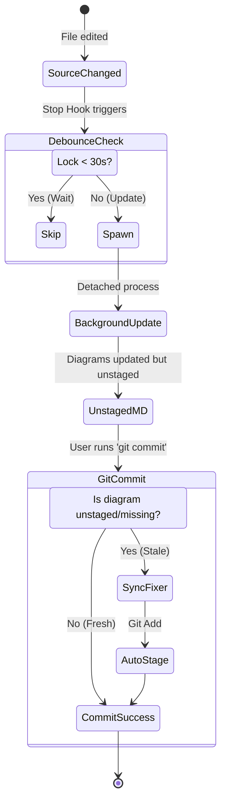

# Codebase Consistency System

How the hook system, automated tests, architecture diagrams, and Greybox checks work together to keep the codebase consistent — whether you're coding interactively, using sub-agents, running agent teams, or doing rapid iteration.

## Overview

The system has three layers of enforcement that fire at different moments:

| Layer | When it runs | Blocking? | Purpose |
|-------|-------------|-----------|---------|
| **PreToolUse hooks** | Before every Bash command | Yes (hard blocks) / No (warnings) | Prevent bad patterns, enforce tool usage, pre-commit checks |
| **Stop hook** | After every Claude Code turn that edits files | Yes (blocks until fixed) | Tests, typechecks, lint, diagram updates |
| **Pre-commit checks** | When `git commit` is executed | Yes (diagram fixer) / No (warnings) | Final validation before code enters history |

```
┌─────────────────────────────────────────────────────────────────┐
│                     You write code                              │
│                                                                 │
│  ┌──────────────┐    ┌──────────────┐    ┌──────────────────┐   │
│  │ PreToolUse   │───▶│ Stop Hook    │───▶│ Pre-Commit       │   │
│  │ (every cmd)  │    │ (every turn) │    │ (git commit)     │   │
│  │              │    │              │    │                  │   │
│  │ Tool blocks  │    │ Tests        │    │ Untested fns     │   │
│  │ npm/yarn     │    │ Typecheck    │    │ Temporal coupling│   │
│  │ destructive  │    │ Lint         │    │ Stale diagrams   │   │
│  │ --no-verify  │    │ MCP errors   │    │                  │   │
│  │              │    │ Diagrams ──┐ │    │ Diagram fixer ─┐ │   │
│  └──────────────┘    └───────────┼─┘    └────────────────┼─┘   │
│                                  │                       │     │
│                          background                 synchronous │
│                          sonnet agent               sonnet agent│
│                          (fire & forget)            (blocks)    │
└─────────────────────────────────────────────────────────────────┘
```

---

## Layer 1: PreToolUse Hooks (Every Bash Command)

These fire **before** every Bash tool invocation. They inspect the command and either block it (exit 2) or let it through (exit 0).

### Hard Blocks (prevent bad patterns)

| Hook | What it blocks | Why |
|------|---------------|-----|
| `block-file-reading.sh` | `cat`, `head`, `tail` | Use the Read tool instead |
| `block-file-editing.sh` | `sed -i`, `awk` with redirects | Use the Edit tool instead |
| `block-content-search.sh` | `grep`, `rg` as first command | Use the Grep tool instead |
| `block-file-search.sh` | `find`, `ls` | Use the Glob tool instead |
| `block-npm-yarn.sh` | `npm`, `yarn`, `npx` | Project uses `bun`/`bunx` exclusively |
| `block-no-verify.sh` | `--no-verify` flag | Fix the issue, don't bypass safety |
| `block-destructive.sh` | `rm -rf`, `git reset --hard`, `git push --force` | Prevent data loss |

These ensure consistent tool usage across all agents — interactive, sub-agents, and agent teams. No agent can accidentally use `npm install` or `grep` directly.

### Pre-Commit Warnings (non-blocking, fire on `git commit`)

| Hook | What it checks | Severity |
|------|---------------|----------|
| `check-untested-functions.sh` | Exported Convex functions with no test references | Warning |
| `check-temporal-coupling.sh` | Files in different modules that change together >60% of the time | Warning |
| `check-diagrams.sh` | Stale, unstaged, or missing architecture diagrams | **Blocking** (spawns fixer) |

---

## Layer 2: Stop Hook (After Every Turn)

The stop hook (`stop-hook.ts`) runs automatically after every Claude Code turn that edits files. It **blocks** (forces Claude to fix the issue) until all checks pass.

### Check sequence

```
Turn ends with file edits
        │
        ▼
┌─ Check 0: Tests ─────────────────────┐
│ Only runs if convex/ files changed    │
│ Command: bun run test                 │
│ BLOCKS if any test fails              │
└───────────────┬───────────────────────┘
                ▼
┌─ Check 1: TypeScript typecheck ───────┐
│ Command: bun run typecheck            │
│ BLOCKS on type errors                 │
└───────────────┬───────────────────────┘
                ▼
┌─ Check 2: Convex typecheck ───────────┐
│ Command: bunx convex typecheck        │
│ Validates schema vs function sigs     │
│ BLOCKS on mismatches                  │
└───────────────┬───────────────────────┘
                ▼
┌─ Check 3: Unused _generated imports ──┐
│ Scans convex/ for dead imports        │
│ BLOCKS if found                       │
└───────────────┬───────────────────────┘
                ▼
┌─ Check 4: Client-only packages ───────┐
│ Blocks React/Next/Radix in convex/    │
│ Skips "use node" files (legitimate)   │
│ BLOCKS if found                       │
└───────────────┬───────────────────────┘
                ▼
┌─ Check 5: Next.js MCP errors ─────────┐
│ Queries localhost:3000/_next/mcp      │
│ Checks for build/runtime errors       │
│ Skipped if dev server not running     │
│ BLOCKS if real errors found           │
└───────────────┬───────────────────────┘
                ▼
        All checks pass
                │
                ▼
┌─ Diagram update (background) ─────────┐
│ Determines affected diagrams from     │
│ file change patterns                  │
│ Debounced: skips if ran <30s ago      │
│ Spawns detached claude -p --model     │
│ sonnet to update diagrams             │
│ Does NOT commit — leaves unstaged     │
└───────────────────────────────────────┘
```

### Diagram pattern mapping

The stop hook maps changed files to affected diagrams:

| Source pattern | Affected diagram |
|---------------|-----------------|
| `convex/schema.ts` | `schema.md` |
| `convex/*.ts`, `convex/<module>/*.ts` | `functions.md` |
| `convex/auth.ts`, `convex/users.ts`, `src/proxy.ts` | `auth-flow.md` |
| `convex/**`, `src/app/*/page.tsx`, `src/components/*.tsx` | `data-flow.md` |
| `convex/<module>/*.ts`, `convex/functions.ts`, `convex/authHelpers.ts` | `greybox.md` |

### Diagram debounce mechanism

A lock file at `/tmp/lucystarter-diagram-update.lock` prevents redundant updates:

```
Turn 1 edits convex/notes.ts
  → Stop hook fires
  → No lock file → spawns Sonnet, writes lock file
  → Sonnet updates functions.md, data-flow.md (background)

Turn 2 edits convex/notes.ts (12 seconds later)
  → Stop hook fires
  → Lock file is 12s old (< 30s) → SKIP diagram update

Turn 3 edits convex/users.ts (45 seconds later)
  → Stop hook fires
  → Lock file is 45s old (> 30s) → spawns Sonnet, refreshes lock
  → Sonnet updates functions.md, auth-flow.md, data-flow.md
```

---

## Layer 3: Pre-Commit Checks (git commit)

When any agent runs `git commit`, three pre-commit hooks fire as PreToolUse checks on the Bash command.

### Untested functions warning

`check-untested-functions.sh` scans all exported Convex functions (`userQuery`, `userMutation`, `adminQuery`, `adminMutation`, `query`, `mutation`, `action`, `internalQuery`, `internalMutation`, `internalAction`) and checks if their names appear anywhere in `convex/**/__tests__/*.test.ts` files.

**Non-blocking** — prints warnings like:
```
⚠ Untested Convex functions:
  - myNewQuery
  - myNewMutation
  Consider adding tests in convex/<service>/__tests__/
```

### Temporal coupling warning (Greybox)

`check-temporal-coupling.sh` analyzes the last 50 commits. For any pair of files in **different** `convex/` modules that change together in >60% of commits (minimum 3 occurrences), it warns:

**Non-blocking** — prints warnings like:
```
⚠ Greybox Warning: These files have high temporal coupling but live in different modules:
  convex/email/send.ts <-> convex/storage/files.ts (changed together in 4/5 commits)
  Consider: Should these share a Deep Module boundary?
```

This directly enforces the **Greybox Principle** — if files always change together, they should be in the same module.

### Diagram staleness check

`check-diagrams.sh` inspects staged files and determines which diagrams they affect. It detects three kinds of staleness:

| State | Detection | What it means |
|-------|-----------|---------------|
| **missing** | Diagram file doesn't exist | New module was added but diagram never created |
| **unstaged** | Diagram has unstaged modifications | Stop hook updated it but it wasn't `git add`ed |
| **outdated** | Diagram unmodified for >5 minutes despite source changes | Stop hook's background update may have failed or was debounced |

**Blocking** — if diagrams are stale:
1. Spawns a **synchronous** Sonnet agent to fix the diagrams (waits for it to finish)
2. Auto-stages the updated diagrams
3. Lets the commit proceed

```
git commit
    │
    ▼
Detect affected diagrams from staged files
    │
    ▼
Any stale? ──No──▶ Commit proceeds
    │
   Yes
    │
    ▼
Spawn claude -p --model sonnet (synchronous, blocks commit)
    │
    ▼
Sonnet reads source files + existing diagrams
    │
    ▼
Sonnet updates diagram files
    │
    ▼
git add memory/ai/diagrams/*.md (auto-stage)
    │
    ▼
Commit proceeds with diagrams included
```

---

## Scenario Walkthroughs

### Scenario 1: Interactive Chat (you + Claude)

The most common flow. You ask Claude to implement a feature, Claude edits files, the stop hook catches issues.

```
You: "Add a deleteNote mutation"

Claude: Edits convex/notes.ts
  │
  ▼ [Turn ends → Stop hook fires]
  │
  ├─ Tests pass? ✓ (or BLOCK → Claude fixes tests)
  ├─ Typecheck? ✓ (or BLOCK → Claude fixes types)
  ├─ Lint? ✓
  ├─ MCP errors? ✓
  └─ Diagram update → background Sonnet updates functions.md

You: "Now commit"

Claude: git commit
  │
  ▼ [PreToolUse hooks fire]
  │
  ├─ check-untested-functions.sh → ⚠ "deleteNote has no tests"
  ├─ check-temporal-coupling.sh → (clean)
  └─ check-diagrams.sh → diagrams are fresh (stop hook updated them)
  │
  ▼
  Commit succeeds (with untested function warning)
```

**Key behavior:** Every turn is validated. Diagrams update in the background. Warnings at commit time remind you to add tests.

### Scenario 2: Sub-agents (Claude spawns helpers)

When Claude delegates work to sub-agents (e.g., using the Agent tool for parallel exploration), each sub-agent operates within the main session's context. The stop hook fires when the **main agent's** turn ends.

```
Main Claude: Delegates 3 research tasks to sub-agents
  │
  ├─ Sub-agent 1: Reads files, returns findings (no edits → no stop hook)
  ├─ Sub-agent 2: Reads files, returns findings (no edits → no stop hook)
  └─ Sub-agent 3: Reads files, returns findings (no edits → no stop hook)
  │
  ▼
Main Claude: Uses findings, edits 4 files
  │
  ▼ [Turn ends → Stop hook fires once]
  │
  All checks run against the combined changes
```

**Key behavior:** Sub-agents that only read don't trigger the stop hook. The main agent's turn is what gets validated, which covers all the changes.

### Scenario 3: Agent Teams (parallel implementation)

This is the big one. You have an implementation plan with 5+ independent features, and agent teams execute them in parallel. Each agent works on its own feature branch or set of files.

```
Plan: Implement features A, B, C, D, E in parallel

Agent A: edits convex/featureA.ts, src/app/(app)/feature-a/page.tsx
  │ [Stop hook fires → tests, typecheck, lint]
  │ [Diagram update → debounce starts (t=0)]
  │
Agent B: edits convex/featureB.ts (t=5s)
  │ [Stop hook fires → tests, typecheck, lint]
  │ [Diagram update → debounced (5s < 30s) → SKIP]
  │
Agent C: edits convex/featureC.ts (t=10s)
  │ [Stop hook fires → tests, typecheck, lint]
  │ [Diagram update → debounced (10s < 30s) → SKIP]
  │
Agent D: edits convex/schema.ts + convex/featureD.ts (t=20s)
  │ [Stop hook fires → tests, typecheck, lint]
  │ [Diagram update → debounced (20s < 30s) → SKIP]
  │
Agent E: edits convex/featureE.ts (t=35s)
  │ [Stop hook fires → tests, typecheck, lint]
  │ [Diagram update → debounce expired (35s > 30s) → spawns Sonnet]
  │ [Sonnet sees ALL changes from A-E, updates all affected diagrams]
  │
  ▼ Eventually: you commit
  │
  ├─ check-untested-functions.sh → warns about any untested new functions
  ├─ check-temporal-coupling.sh → checks if new files are coupling across modules
  └─ check-diagrams.sh → if diagrams are stale, spawns synchronous fixer
  │
  ▼
  Commit includes code + up-to-date diagrams
```

**Key behaviors:**
- Each agent independently gets tests + typecheck validation (no broken code merges)
- Diagram updates are debounced — only one runs at a time, and it reflects the latest state
- The pre-commit diagram check is the safety net — if any diagram was missed, it fixes it synchronously before the commit

### Scenario 4: Rapid Changes (quick iteration loop)

You're doing rapid back-and-forth: "change this", "no wait, do it this way", "actually add X too". Many turns in quick succession.

```
Turn 1 (t=0s): Edit convex/notes.ts
  → Stop hook: tests + typecheck + lint ✓
  → Diagram update: spawns Sonnet (lock at t=0)

Turn 2 (t=8s): Edit convex/notes.ts again
  → Stop hook: tests + typecheck + lint ✓
  → Diagram update: debounced (8s < 30s) → SKIP

Turn 3 (t=15s): Edit src/app/(app)/notes/page.tsx
  → Stop hook: typecheck + lint ✓ (no convex/ changes → skip tests)
  → Diagram update: debounced (15s < 30s) → SKIP

Turn 4 (t=40s): Edit convex/notes.ts
  → Stop hook: tests + typecheck + lint ✓
  → Diagram update: lock expired → spawns fresh Sonnet
  → Sonnet sees all cumulative changes, updates diagrams
```

**Key behavior:** Tests and typechecks run every turn (fast, essential). Diagram updates are batched via debounce so you don't waste cycles on intermediate states. The final diagram reflects the actual current code, not some mid-edit snapshot.

### Scenario 5: The Commit Flow (detailed)

Here's exactly what happens when any agent runs `git commit`:

```
git commit -m "feat: add note sharing"
  │
  ▼ PreToolUse hooks fire (in order):
  │
  ├─ block-file-reading.sh       → N/A (not cat/head/tail)
  ├─ block-file-editing.sh       → N/A (not sed/awk)
  ├─ block-content-search.sh     → N/A (not grep/rg)
  ├─ block-file-search.sh        → N/A (not find/ls)
  ├─ block-npm-yarn.sh           → N/A (not npm/yarn)
  ├─ block-no-verify.sh          → N/A (no --no-verify)
  ├─ block-destructive.sh        → N/A (not destructive)
  │
  ├─ check-untested-functions.sh
  │   └─ Scans convex/ for exported functions
  │   └─ Cross-references with __tests__/*.test.ts
  │   └─ Prints warnings for untested functions
  │   └─ exit 0 (non-blocking)
  │
  ├─ check-temporal-coupling.sh
  │   └─ Analyzes last 50 commits for cross-module coupling
  │   └─ Flags file pairs that change together >60% of time
  │   └─ Prints Greybox warnings
  │   └─ exit 0 (non-blocking)
  │
  └─ check-diagrams.sh
      └─ Reads staged files
      └─ Maps to affected diagrams
      └─ Checks: missing? unstaged? outdated (>5 min)?
      │
      ├─ All clean → exit 0 (commit proceeds)
      └─ Stale found:
          └─ Spawns synchronous Sonnet fixer
          └─ Waits for completion
          └─ git add memory/ai/diagrams/*.md
          └─ exit 0 (commit proceeds with diagrams)
```

---

## The Testing System

### Test infrastructure

Tests live in `convex/<service>/__tests__/` using **vitest + convex-test**. The test setup (`convex/__tests__/setup.ts`) uses `import.meta.glob` to load all Convex modules, and helpers (`convex/__tests__/helpers.ts`) provide:

| Helper | Purpose |
|--------|---------|
| `createTest()` | Create a fresh convex-test instance with schema + modules |
| `createTestUser(t, opts?)` | Seed a user in DB, return authenticated test accessor |
| `createAdminUser(t, opts?)` | Seed an admin user, return authenticated test accessor |

### When tests run

| Trigger | Condition |
|---------|-----------|
| **Stop hook** | Any `convex/` file was changed in the current turn |
| **Manual** | `bun run test` |

Tests do **not** run if only frontend files changed (no `convex/` paths in the transcript).

### Test philosophy (Greybox)

Tests are **outcome-focused** — they assert results, not internal steps:

```typescript
// Good: tests the outcome
const notes = await asUser.query(api.notes.list, {});
expect(notes).toHaveLength(1);
expect(notes[0].title).toBe("My Note");

// Bad: mocks internal steps
// jest.spyOn(db, 'insert').mockResolvedValue(...)
```

The `check-untested-functions.sh` hook warns at commit time if you've added a new exported function without corresponding test coverage.

---

## The Greybox Enforcement System

The Greybox Principle ("Accessible but Irrelevant") is enforced through multiple mechanisms:

### Design-time (documentation)

- `docs/design/greybox_principle.md` — full reference document
- `memory/ai/diagrams/greybox.md` — auto-maintained diagram showing module boundaries, public APIs vs internals

### Build-time (stop hook)

The stop hook's lint checks enforce module boundaries:
- **Unused imports** — dead imports often indicate a broken seam where something was moved into a deep module
- **Client-only packages** — React/Next.js in `convex/` means the boundary between frontend and backend leaked

### Commit-time (temporal coupling check)

`check-temporal-coupling.sh` is the Greybox enforcement at the code history level. If files in `convex/email/` and `convex/storage/` always change together, they probably belong in the same module. The hook surfaces this automatically.

### Architecture review (skill)

The `greybox-review` skill provides on-demand audits. It reads the current module structure and evaluates:
- **Depth** — does the interface hide complexity?
- **Opacity** — can you swap internals without changing consumers?
- **Outcome-focus** — do tests assert results?

---

## Architecture Diagrams

Five auto-maintained diagrams in `memory/ai/diagrams/`:

| Diagram | Contents | Updated when |
|---------|----------|-------------|
| `schema.md` | ER diagram, indexes, roles, validators | `convex/schema.ts` changes |
| `functions.md` | All Convex functions, auth level, table access | Any `convex/*.ts` or `convex/<module>/*.ts` changes |
| `auth-flow.md` | Sign-in sequence, route protection, JWT flow | Auth-related files change |
| `data-flow.md` | Reactive queries, upload/chat/email flows | Any convex or frontend changes |
| `greybox.md` | Deep module boundaries, public vs internal APIs | Module structure or shared infra changes |

### Update lifecycle



Diagrams are **never committed separately** from the code they describe. They're always part of the same commit as the source changes.

---

## Summary: What Protects What

| Concern | Protected by | When |
|---------|-------------|------|
| Wrong tool usage (cat, grep, npm) | PreToolUse block hooks | Every Bash command |
| Destructive operations | `block-destructive.sh` | Every Bash command |
| Bypassing safety checks | `block-no-verify.sh` | Every Bash command |
| Type errors | Stop hook (TypeScript + Convex typecheck) | Every turn |
| Test failures | Stop hook (`bun run test`) | Every turn touching `convex/` |
| Dead imports | Stop hook (unused _generated imports) | Every turn |
| Frontend/backend boundary | Stop hook (client-only packages) | Every turn |
| Runtime errors | Stop hook (Next.js MCP) | Every turn (if dev server running) |
| Untested functions | `check-untested-functions.sh` | Every commit (warning) |
| Cross-module coupling | `check-temporal-coupling.sh` | Every commit (warning) |
| Stale diagrams | `check-diagrams.sh` | Every commit (blocking fixer) |
| Diagram freshness during work | Stop hook (background Sonnet, debounced) | Every turn |
| Module boundary design | Greybox skill + temporal coupling hook | On-demand + every commit |
