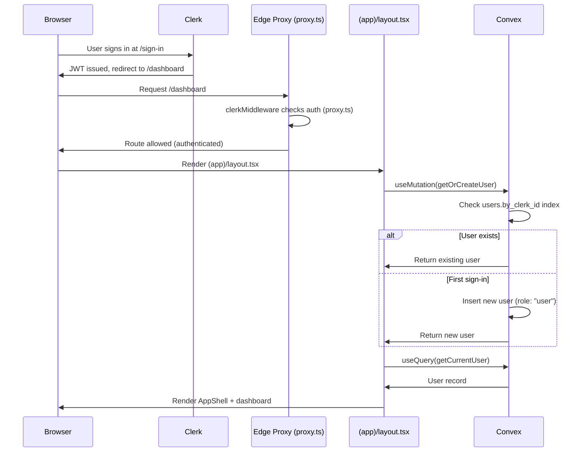
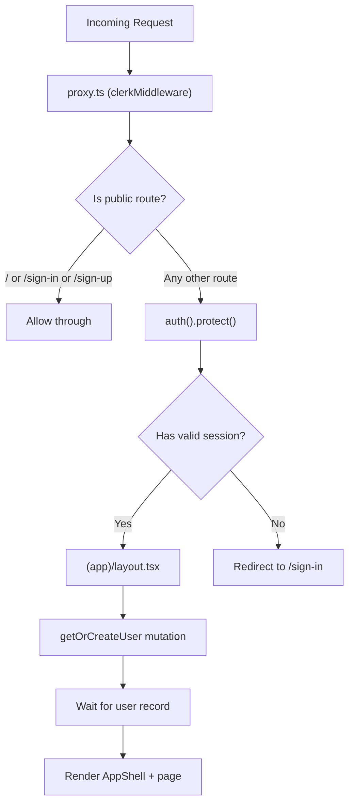
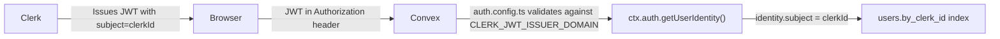

# Authentication Flow

## Sign-In Sequence

## Route Protection

## JWT Flow

## Key Files

| File | Role |
|------|------|
| `convex/auth.config.ts` | Clerk JWT provider config |
| `convex/auth.ts` | Auth guards (getCurrentUser, requireAuth, requireAdmin) |
| `convex/users.ts` | getOrCreateUser auto-provisioning |
| `src/proxy.ts` | Edge proxy — route protection (public vs protected) |
| `src/components/providers.tsx` | ConvexProviderWithClerk wiring |
| `src/app/(app)/layout.tsx` | Auth gate + user provisioning on mount |
| `src/app/sign-in/[[...rest]]/page.tsx` | Clerk SignIn component |
| `src/app/sign-up/[[...rest]]/page.tsx` | Clerk SignUp component |
