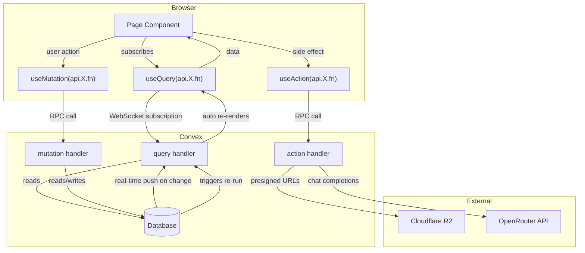
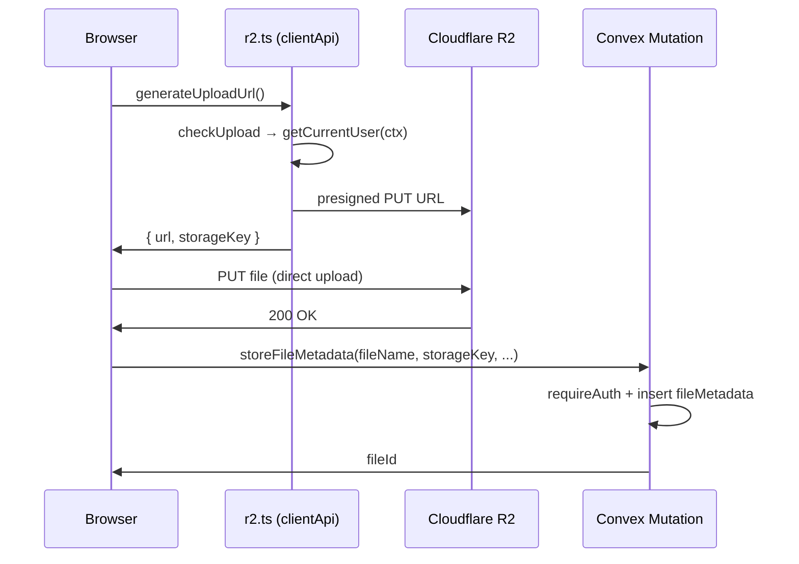
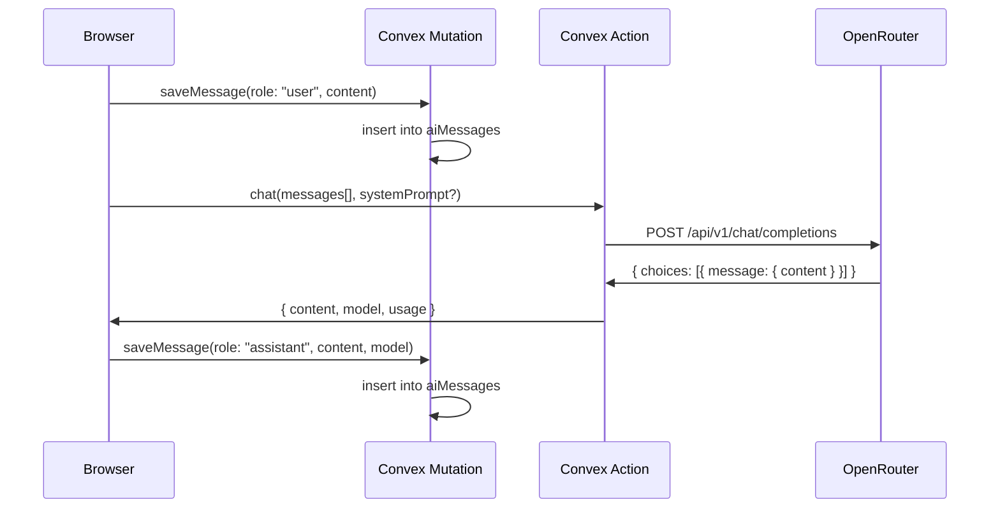
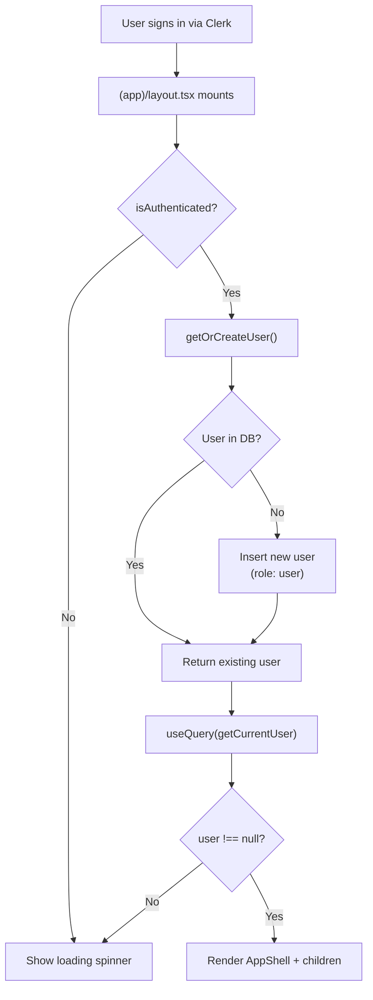

# Data Flow

## Client → Convex Reactive Loop

## R2 File Upload Flow

## AI Chat Flow

## User Provisioning Flow

## Key Patterns

| Pattern | Where | How |
|---------|-------|-----|
| Reactive queries | All pages | `useQuery()` auto-updates when data changes |
| Auth-gated mutations | All writes | `requireAuth(ctx)` before any DB write |
| Owner-only writes | notes, files | Check `record.authorId === user._id` |
| Auto-provisioning | (app)/layout.tsx | `getOrCreateUser()` on mount |
| Skip pattern | (app)/layout.tsx | `useQuery(api.X, isAuthenticated ? {} : "skip")` |
| `"use node"` split | r2Actions, aiActions | Node packages in separate action-only files |
| Presigned URLs | r2.ts (clientApi) | Browser uploads directly to R2, Convex stores metadata |
| External API calls | aiActions.ts | Actions can fetch(), queries/mutations cannot |
