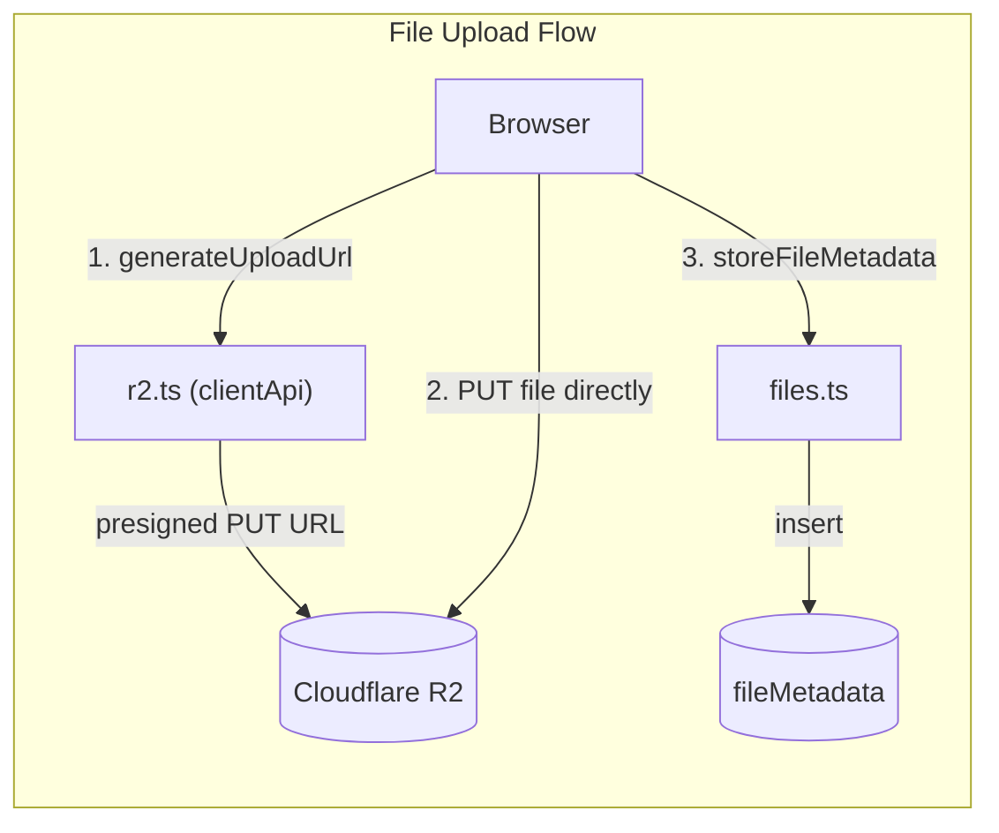
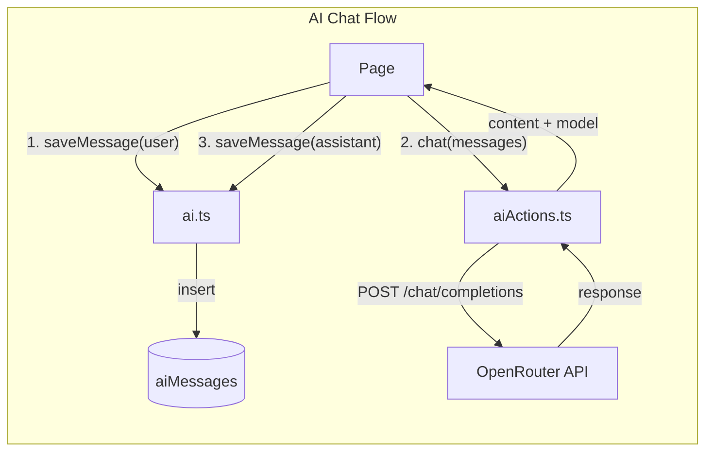

# Convex Functions

## users.ts

| Function | Type | Auth | Tables | Description |
|----------|------|------|--------|-------------|
| `getCurrentUser` | query | any (null if unauthed) | users | Get current user record |
| `getOrCreateUser` | mutation | authenticated | users | Auto-provision on first sign-in |
| `updateProfile` | mutation | requireAuth | users | Update own name |
| `updateUserRoles` | mutation | requireAdmin | users | Change any user's roles |
| `getAllUsers` | query | authenticated | users | List all users (id, name, email, roles) |

## notes.ts (Demo)

| Function | Type | Auth | Tables | Description |
|----------|------|------|--------|-------------|
| `list` | query | requireAuth | notes | Own notes + public notes, deduped, sorted by date |
| `create` | mutation | requireAuth | notes | Create note (title, body, isPublic) |
| `update` | mutation | requireAuth + owner | notes | Update own note |
| `remove` | mutation | requireAuth + owner | notes | Delete own note |

## files.ts (R2 metadata)

| Function | Type | Auth | Tables | Description |
|----------|------|------|--------|-------------|
| `storeFileMetadata` | mutation | requireAuth | fileMetadata | Save metadata after R2 upload |
| `getMyFiles` | query | requireAuth | fileMetadata | List current user's files |
| `deleteFile` | mutation | requireAuth + owner | fileMetadata | Delete metadata and R2 object |

## r2.ts (R2 client + clientApi)

| Function | Type | Auth | External | Description |
|----------|------|------|----------|-------------|
| `generateUploadUrl` | clientApi | getCurrentUser (checkUpload) | Cloudflare R2 | Get presigned PUT URL for direct upload |
| `syncMetadata` | clientApi | getCurrentUser (checkUpload) | Cloudflare R2 | Sync file metadata after upload |

## r2Actions.ts (`"use node"` — R2 downloads)

| Function | Type | Auth | External | Description |
|----------|------|------|----------|-------------|
| `generateDownloadUrl` | action | none | Cloudflare R2 | Get presigned GET URL for download |

## ai.ts (Message history)

| Function | Type | Auth | Tables | Description |
|----------|------|------|--------|-------------|
| `listMessages` | query | requireAuth | aiMessages | User's chat history |
| `saveMessage` | mutation | requireAuth | aiMessages | Save user or assistant message |
| `clearHistory` | mutation | requireAuth | aiMessages | Delete all user's messages |

## aiActions.ts (`"use node"` — OpenRouter)

| Function | Type | Auth | External | Description |
|----------|------|------|----------|-------------|
| `chat` | action | getUserIdentity | OpenRouter API | Send chat completion, return response |

## auth.ts (Guards)

| Guard | Returns | Throws |
|-------|---------|--------|
| `getCurrentUser(ctx)` | Doc\<users\> | AuthError, NotFoundError |
| `requireAuth(ctx)` | Doc\<users\> | AuthError, NotFoundError |
| `requireAdmin(ctx)` | Doc\<users\> | AuthError, ForbiddenError |
| `hasRole(ctx, role)` | boolean | never (returns false on error) |
