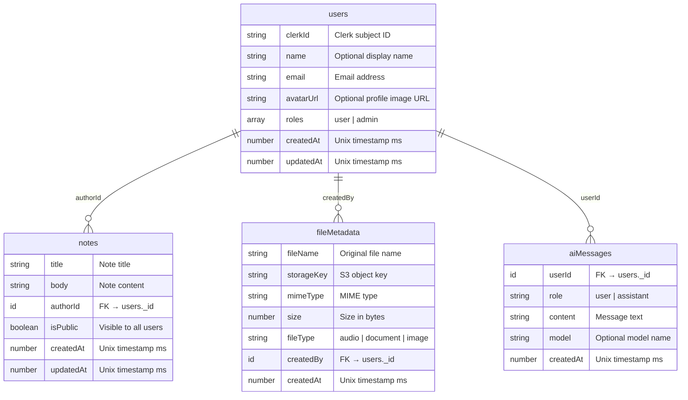

# Database Schema

## Indexes

| Table | Index | Fields | Purpose |
|-------|-------|--------|---------|
| users | by_clerk_id | clerkId | Clerk auth lookup |
| users | by_email | email | Email lookup |
| fileMetadata | by_created_by | createdBy | User's files |
| fileMetadata | by_file_type | fileType | Filter by type |
| aiMessages | by_user | userId | User's chat history |
| notes | by_author | authorId | User's own notes |
| notes | by_public | isPublic | Public notes feed |

## Roles

| Role | Description |
|------|-------------|
| user | Default role for all new users |
| admin | Full access, can manage user roles |

## Validators (exported from schema.ts)

| Validator | Values |
|-----------|--------|
| `roleValidator` | `"user"` \| `"admin"` |
| `fileTypeValidator` | `"audio"` \| `"document"` \| `"image"` |
